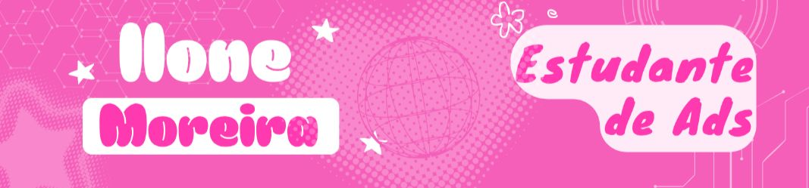

<p align="center">
  
</p>

<div align="center">

# Olá! Eu sou a Ilone Letícia 👋

### Desenvolvedora em formação • JavaScript • C# • SQL

Construindo projetos, aprendendo na prática e tentando deixar a tecnologia
mais acessível — inclusive para quem precisa de configurações visuais
específicas para conseguir navegar com conforto.

</div>

---

## 🧩 Sobre mim

- 💻 Estudante de Análise e Desenvolvimento de Sistemas na Puc-Minas
- 🌐 Tenho estudado principalmente **JavaScript** e **C#**
- ♿ Tenho um interesse especial por **algoritimos** e **aplicações web**
- 🎨 Gosto de pensar em interfaces que sejam fáceis de ler, navegar e entender
- 📚 Atualmente estou ampliando meus conhecimentos em desenvolvimento back-end e banco de dados SQL
- 🚀 Meu objetivo é continuar transformando o que aprendo em projetos reais

---

## 🛠️ Tecnologias

<div align="center">


</div>

---

## ♿ Acessibilidade

A acessibilidade visual é uma parte importante da forma como penso interfaces.

Detalhes como **tamanho da fonte, espaçamento entre letras,
contraste, organização das informações e legibilidade** fazem diferença
na experiência de uso para mim e eu sei que para muitos outros também.

Por isso, sempre que possível, tento levar esses aspectos para os projetos
que desenvolvo.

---

## 📊 GitHub


<picture>
  <source media="(prefers-color-scheme: dark)" srcset="https://raw.githubusercontent.com/IloneLeticia/IloneLeticia/output/snake-dark.svg">
  <source media="(prefers-color-scheme: light)" srcset="https://raw.githubusercontent.com/IloneLeticia/IloneLeticia/output/snake.svg">
  
</picture>


## 🌱 Atualmente

```text
Aprendendo        → Desenvolvimento back end
Praticando        → JavaScript e C#
Explorando        → banco de dados e modelagem de processos
Construindo       → Projetos para colocar conhecimento em prática
```

---

<div align="center">

### Obrigada por visitar meu perfil!

**Sempre aprendendo. Sempre construindo.**

</div>
